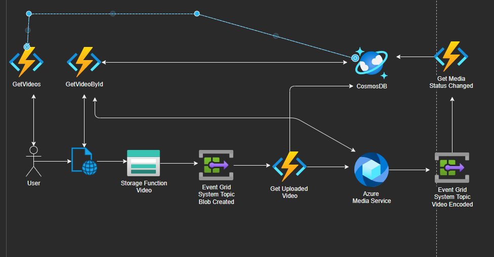

# Azure Media Service Conversion Demo
https://blazor-hgtdne.azurewebsites.net/

## Architecture

## Getting started

### Prerequisites
1. An active Azure subscription, you can [create one for free](https://azure.microsoft.com/en-us/free/).
2. Clone or fork of this repository.

### Deployment
Github workflows are included for deploying the solution to Azure.

Simply run the workflows under [Actions](https://github.com/hugogirard/mediaServiceConversion/actions) for deployment, which includes the following steps:
1. Create required Azure resources: 
- Resource group
- Azure Media Service (with a streaming endpoint)
- Functions app (backend)
- Azure storage accounts
and bicep files to validate each build for CI/CD.

2. Set up the following secrets:
- ``AZURE_CREDENTIALS``: used by Github actions to authenticate with Azure. Follow these [instructions](https://learn.microsoft.com/en-us/azure/developer/github/github-key-vault) to create a secret using Azure Service Principal.
    - ``SP_CLIENT_ID``
    - ``SP_CLIENT_SECRET``
- ``AZURE_SUBSCRIPTION``
- ``PA_TOKEN``: used to authenticate Github actions

3. Deploy the functions app

4. Deploy the frontend (blazor client)

5. Register the Event Grid subscription

## Resources
https://docs.microsoft.com/en-us/azure/azure-functions/functions-event-grid-blob-trigger?pivots=programming-language-csharp